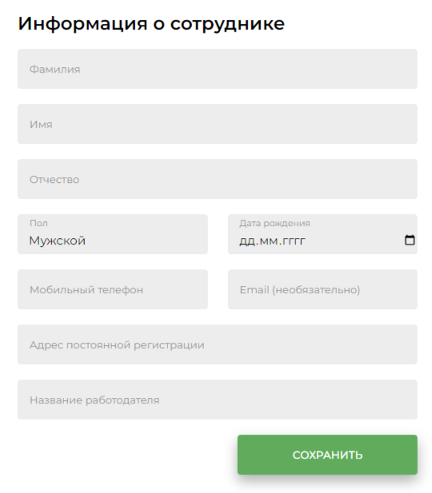
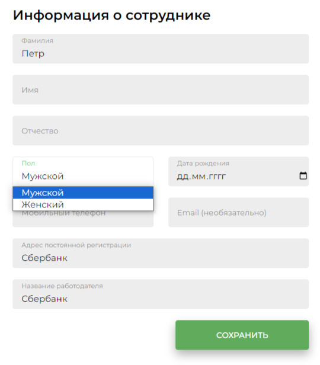
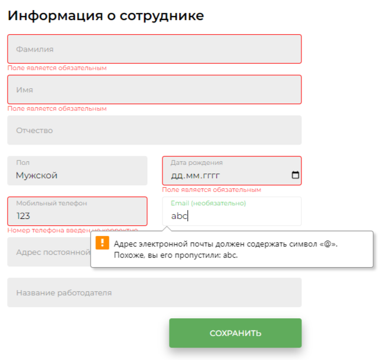

## Форма для добавления данных о человеке
### Техническая информация, Функционал:
* Проект реализован на React + TypeScript.
* Использован препроцессор SCSS.
* Для валидации формы использована библиотека YUP.
* По нажатию на кнопку "Сохранить" срабатывает валидация и если все поля валидны,
выводится alert('Форма валидна, отправляется запрос’).
* Поля "Фамилия", "Имя", "Дата рождения", "Мобильный телефон” и “Email” являются
  обязательными и валидируются при нажатии на кнопку "Сохранить".
* Поле "Пол" реализовано в виде select box.
* Для полей “Мобильный телефон”, "Email" реализована проверка на корректность
  введеннй информации.

